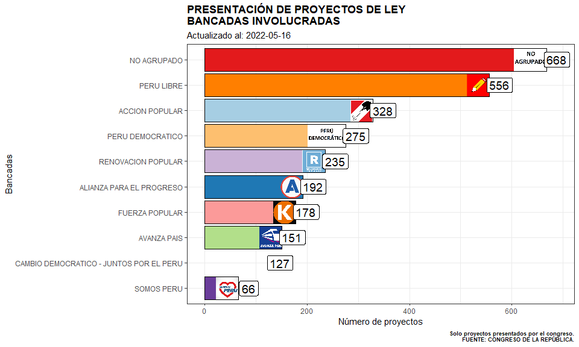
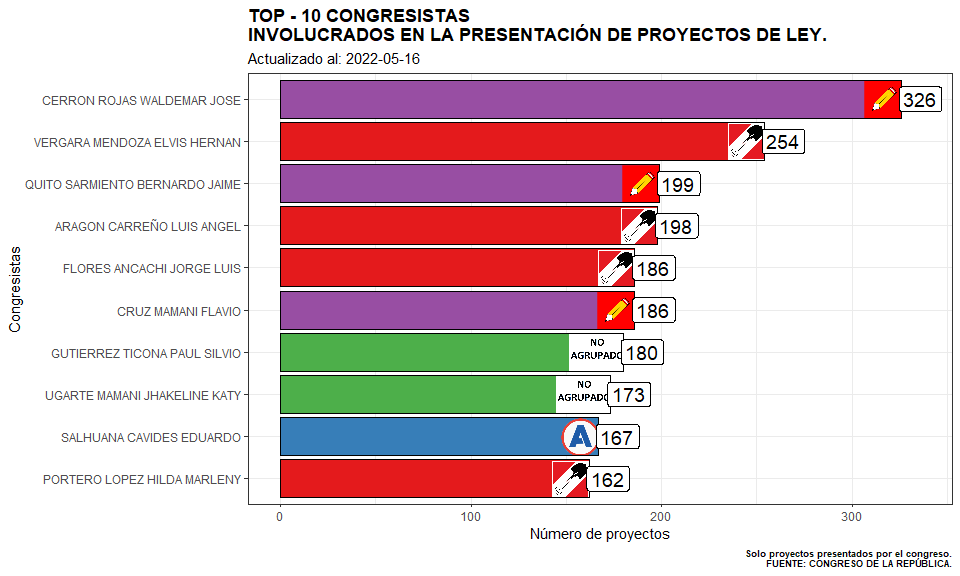
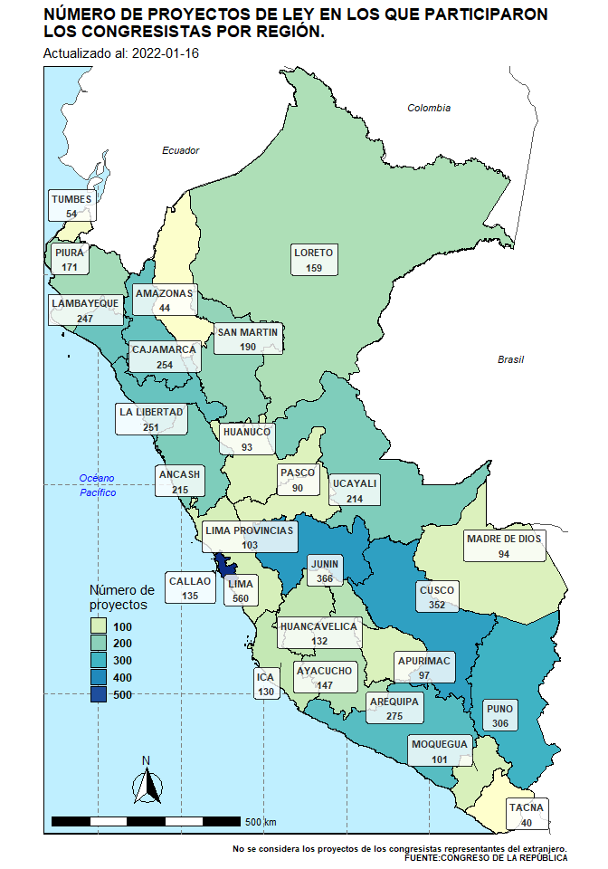
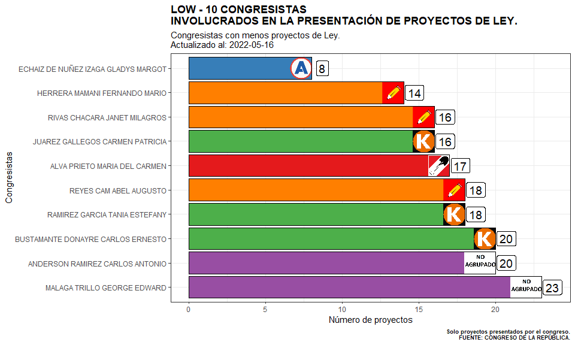
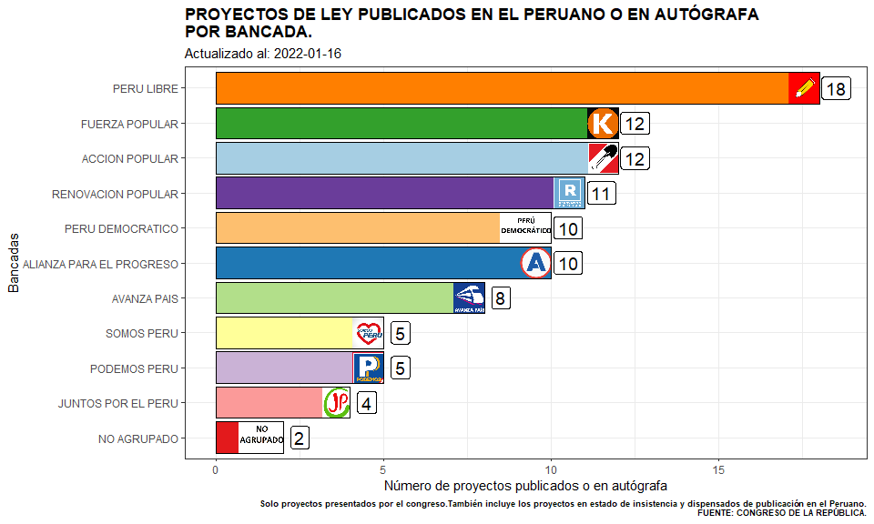
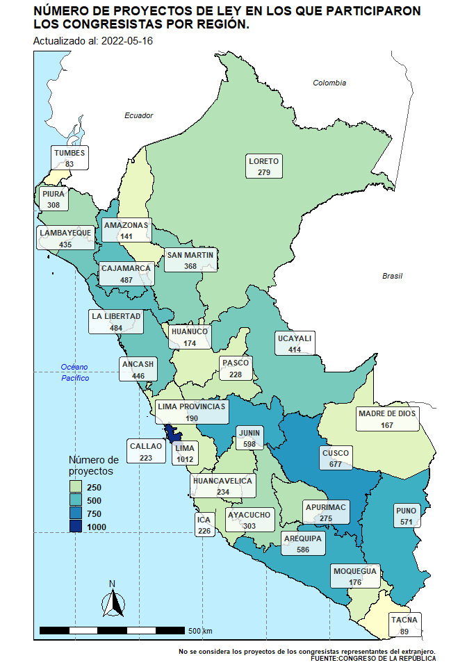
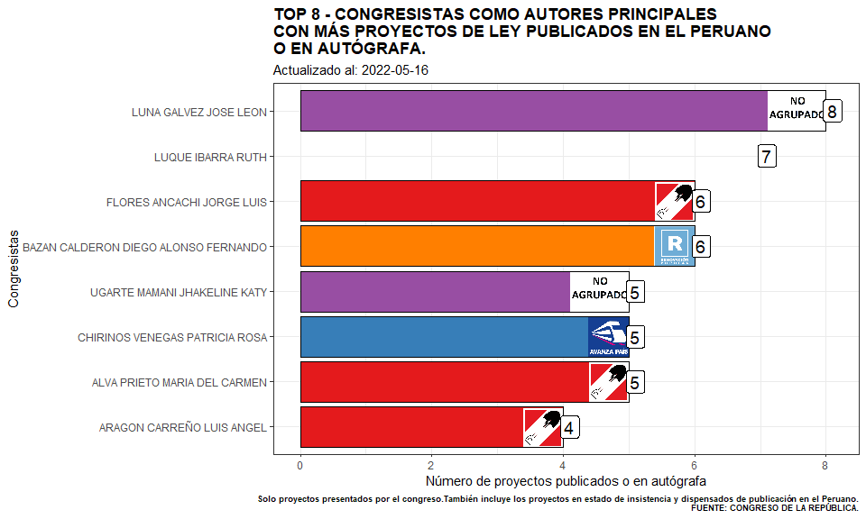

# BIENVENIDOS!!!

# ¿CÓMO ESTÁN TRABAJANDO LOS CONGRESISTAS DEL PERÚ - PROYECTOS DE LEY?

Actualizado a **2022-01-16**.

Se crea este repositorio con el fin de poder conocer cómo están
trabajando los congresistas de la república del Perú, específicamente en
la presentación de proyectos de ley y en la concreción final de
convertirse en ley.

Se muestra información del número de proyectos de ley y leyes por
bancadas, regiones y por congresistas.

Esta información se extrajo desde el portal Voto informado. —>
<https://www.congreso.gob.pe/>

Los códigos lo puede encontrar en el repositorio con el nombre de
`script_congreso_pl.R` y el data frame que compila toda la información
es `df`.

## ¿CÓMO ESTÁ TRABAJANDO EL CONGRESO?

### PROYECTOS DE LEY.

#### Bancadas involucradas en la presentación de proyectos de ley.

<!-- -->

#### Participación relativa de bancadas en la presentación de proyectos de ley.

<!-- -->

#### Congresistas con más proyectos de ley presentados.

<!-- -->

#### Congresistas como autores principales en la presentación de proyectos de ley.

<!-- -->

#### Proyectos de ley presentados por regiones.

    # Reading layer `Sudamérica' from data source 
    #   `C:\OTROS\shapefile\sudamerica\Sudamérica.shp' using driver `ESRI Shapefile'
    # Simple feature collection with 15 features and 1 field
    # Geometry type: MULTIPOLYGON
    # Dimension:     XY
    # Bounding box:  xmin: -109.4461 ymin: -58.49861 xmax: -26.24139 ymax: 12.59028
    # Geodetic CRS:  WGS 84

<!-- -->

#### Participación relativa en la presentación de proyectos de ley por regiones.

    # Reading layer `Sudamérica' from data source 
    #   `C:\OTROS\shapefile\sudamerica\Sudamérica.shp' using driver `ESRI Shapefile'
    # Simple feature collection with 15 features and 1 field
    # Geometry type: MULTIPOLYGON
    # Dimension:     XY
    # Bounding box:  xmin: -109.4461 ymin: -58.49861 xmax: -26.24139 ymax: 12.59028
    # Geodetic CRS:  WGS 84

<!-- -->

#### Proyectos de ley publicados o en autografa por bancada.

<!-- -->

#### Participación en proyectos de ley que han sido publicados o en autografa.

<!-- -->

#### Congresistas involucrados en leyes publicadas en el peruano o en autografa.

<!-- -->

#### Congresistas como autores principales en leyes publicadas en el peruano o en autógrafa.

<!-- -->

### Palabras más usadas en los títulos de los proyectos de ley.

<!-- -->

### Palabras que se relacionan más en los proyectos de ley.

<!-- -->

### Palabras más usadas en la presentación de proyectos de ley del top 4 congresistas con más proyectos de ley presentados.

<!-- -->

### Palabras que más se relacionan en la presentación de proyectos de ley del top 4 congresistas con más proyectos de ley presentados.

<!-- -->

## Actualizaciones.

La primera versión se publicó el día **11/12/2021**, pero en los
siguientes días se ha venido actualizando la información, en un
principio se pensó hasta el 15 de diciembre, pero el congreso amplió su
legislatura y estará sesionando hasta el 17 de enero de 2022, día que
entrará en receso el congreso.

Para la extracción, limpieza y gráficos del repositorio se usa el
software R en su totalidad. Si tiene alguna sugerencia o comentario
puede enviarnos un correo a: **<pe.cesar.huamani.n@uni.pe>** o
**<cesar.huamani@datametria.com>**

Muchas gracias.
